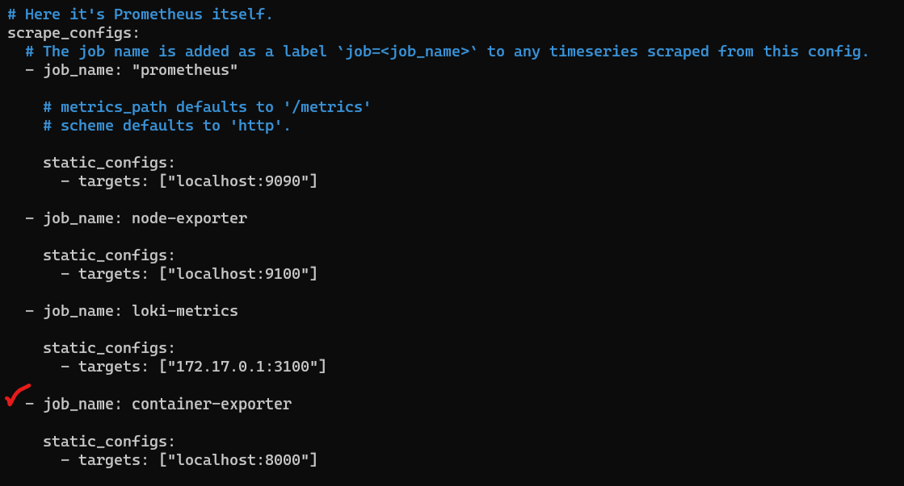

# 🚀 Container Exporter (CXP)

A resource-friendly, highly efficient, and minimal Prometheus exporter to track Memory, CPU, Disk and Network I/O usage of Docker containers along with their lifecycle (uptime).

## Table of Contents
1. [DEV STACK](#%EF%B8%8F-dev-stack)
2. [DEMO](#-demo)
3. [Step-by-Step Guide](#-step-by-step-guide)
   1. [Before You start](#before-you-start)
   2. [Getting started](#getting-started)
      - [Deploy with Docker](#-deploy-with-docker)
      - [Deploy without Docker](#-cant-use-docker-ok-then-)
      - [Run with a Custom Port](#-run-with-a-custom-port)
   3. [Add CXP to Prometheus](#-add-cxp-to-prometheus)
4. [Grafana Dashboards](#-grafana-dashboards)
5. [TO-DO](#to-do)
6. [Contributions](#contributions)
7. [Contact Information](#contact-information)

## 🛠️ DEV STACK
    

see a sample of the metrics page in [here](./extra/metrics.txt).

## 🎥 DEMO


## 📋 Step-by-Step Guide

### Before You start
 - Port 8000 must be open (default port)
 - Docker & Docker Compose should be installed (optional)
 - The presence of Git and Python3

### Getting started

#### 🐳 Deploy with Docker
- clone and enter the repository using the following commands:
```bash
  git clone https://github.com/Shayan-Ghani/Container-exporter.git
  cd Container-Exporter
```
- Deploy the docker-compose file that suits you the best for instance :
```bash 
# Make the file executable
  chmod +x ./start.sh

# With docker compose v1
  docker-compose -f container-exporter.yml up -d
# Or using v2
  docker compose -f container-exporter.yml up -d
# build from base with Dockerfile
  docker-compose -f container-exporter-local.yml up --build -d
```
*alternatively, run `docker-compose -f container-exporter-local.yml up --build -d` to build from Dockerfile*

#### 🐍 Can't use Docker? Ok then :
```bash
# No need if done already
  chmod +x ./start.sh

# Set up virtualenv
  python3 -m venv venv
  source venv/bin/activate
  pip install -U pip

# Install the required python packages
  pip install -r requirements.txt

# start the initializer script.
  ./start.sh &
``` 

You can use nohup as well : 
```
nohup ./start.sh -out ./nohup.out

# to stop cxp without docker use this command 
kill -9 <PID>
```
Replace `<PID>` with the pid of ./start.sh script.

#### 🚢 Run With A Custom Port:
```bash
./start.sh <your custome port> &  
# or 
CONTAINER_EXPORTER_PORT=<your custom port> docker-compose -f container-exporter.yml up -d
```

Change `<your custom port>` with a port of your choice and **make sure you change the port mapping in docker-compose accordingly.**

### 🔥 Add CXP to Prometheus
- Edit your `prometheus.yml` file and add the address of container-exporter in scrape_configs:



- Reload or restart your Prometheus server and reach out to `http://127.0.0.1:8000/metrics`
### That is it you are good to go, Enjoy Using CXP! "}"

## 📊 Grafana Dashboards
Check out [dashboards](./dashboards) directory for Json files. including CPU & Memory usage + containers status (uptime).

**Change `Your Prometheus data source uid` with the uid of Prometheus data source uid. you can find it this way:** 
- Reach out to Grafana then enter  `Home > Administration > Data sources`  then click on your Prometheus data source.
- the characters after `datasources/edit/` are your uid. (e.g datasources/edit/**c8e586ac-4262-4aad5-a103-1240ss826424**)

- alternatively, use `dashboard-gen.sh` script to change the dashboards' uid by providing the uid as the first argument of the script. do the following steps:

```
 cd scripts && bash dashboard-gen.sh <your uid> 
```
- replace `<your uid>` with your Prometheus datasource uid. 

- now head to Grafana dashboards and hit `new > import` then copy the dashboard Json file and paste it into `Import via panel json`

- hit the `load` button and Done!

## TO-DO
 - [x]  Disk I/O usage 
 - [x]  Network I/O Usage
 - [x]  Add metrics in units of byte
 - [ ]  Design grafana dashboards and share them on grafana cloud
 - [ ]  Check and Unregister *stat* metrics for containers that are not running
## Contributions
Welcome to CXP! This project is currently in an experimental yet stable version, and we encourage contributions to enhance its functionality, optimize code, and add new features

Feel free to contribute in any wacacy you can. If you come across a bug or have a suggestion, please don't hesitate to file an issue. Your input is valuable and helps us improve CXP for everyone; Therefore, add any desired function or feature to TO DO section. We appreciate your contribution to making CXP even better! If you have any questions or need assistance, feel free to reach out. Thank you!

- If you want to add metrics to cxp, make sure the naming convention is conformed to. (`container_metric_name`)